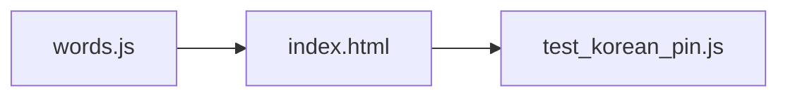

<!-- GENERATED by the doc pipeline — DO NOT EDIT. Hand edits are detected nightly and overwritten. To change this document, change the code or the harvest config (infrastructure/docs/pipeline). -->
[Scope](1_SCOPE_AND_PURPOSE.md) · **System** · [Flows](3_WORKFLOWS.md) · [Data](4_DATA_AND_INTEGRATIONS.md) · [Quality](5_QUALITY_AND_OPERATIONS.md) · [Internals](6_INTERNALS.md)

# korean-word-of-the-day — two static files, one deterministic word rotation

## Components

### `words.js` — word bank

**Role:** holds the word bank in a global `window.KOREAN_WORDS` array. Each entry carries the fields the Resting Screen renders: `ko` (Hangul hero glyph), `roman` (Revised Romanization), `sound` (actual pronunciation, deliberately different from `roman`), `pos` (part of speech), `meaning`, `syl` (per-syllable `[hangul, roman]` pairs), and `ex` (`[korean, english]` example sentences). Adding a word is data-only — never a layout change. The bank contains 20 entries total, from 설레다 to 편안하다.

**Entry point:** `words.js`.

### `index.html` — Resting Screen renderer

**Role:** renders the word of the day and the word clock. Rotation of words is deterministic by local calendar date, with no API, tokens, or network. Index 0 is 설레다 so day one matches the approved mockup exactly. A specific date can pin a specific word. The file is static — no build step, no keys, no network calls, no tracking.

**Entry point:** `index.html`.

### `tests/test_korean_pin.js` — date-pin tests

**Role:** behavioral tests for the date-pin logic. Verifies a pinned date renders its pinned word, pins never shift the surrounding rotation, and every pin entry is shape-complete so the screen can never render blank panels.

**Entry point:** `tests/test_korean_pin.js`.

## Connections

- `index.html` reads `window.KOREAN_WORDS` from `words.js` to render the word of the day.
- `index.html` renders the word clock from the same `window.KOREAN_WORDS` array.
- `tests/test_korean_pin.js` loads `words.js` and `index.html` to verify the date-pin logic.
- `words.js` has no dependencies — it is a pure data module.
- `index.html` has no dependencies beyond `words.js` — no external systems, APIs, or network.

## Diagram

