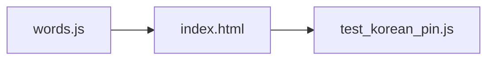

<!-- GENERATED by the doc pipeline — DO NOT EDIT. Hand edits are detected nightly and overwritten. To change this document, change the code or the harvest config (infrastructure/docs/pipeline). -->
[Scope](1_SCOPE_AND_PURPOSE.md) · **System** · [Flows](3_WORKFLOWS.md) · [Data](4_DATA_AND_INTEGRATIONS.md) · [Quality](5_QUALITY_AND_OPERATIONS.md) · [Internals](6_INTERNALS.md)

# korean-word-of-the-day — two static files, one deterministic word per day

## Components

### `words.js` — word bank
- **Role:** holds the word bank in a global `window.KOREAN_WORDS` array. Each entry contains Korean text, romanization, pronunciation, part of speech, meaning, syllables, and example sentences. The data shape mirrors exactly what the Resting Screen design renders, so adding a word is data-only, never a layout change. The `sound` field is deliberately not the same string as `roman`, as romanization is not a pronunciation guide.
- **Entry point:** `words.js`.

### `index.html` — resting screen renderer
- **Role:** renders the word of the day and the word clock. Word rotation is deterministic by local calendar date, with no API, tokens, or network calls. A specific date can pin a specific word. The first word is 설레다, ensuring day one matches the approved mockup. The hero line auto-shrinks past 4 syllables.
- **Entry point:** `index.html`.

### `tests/test_korean_pin.js` — date-pin tests
- **Role:** behavioral tests for the date-pin logic. Verifies a pinned date renders its pinned word, pins never shift the surrounding rotation, and every pin entry is shape-complete so the screen can never render blank panels.
- **Entry point:** `tests/test_korean_pin.js`.

## Connections

- `index.html` reads `window.KOREAN_WORDS` from `words.js` to render the word of the day and the word clock.
- `tests/test_korean_pin.js` imports the date-pin logic from `index.html` and validates it against the word bank in `words.js`.
- `index.html` renders directly from the word bank; no other component writes to or modifies the word bank at runtime.

## Diagram

