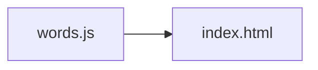

<!-- GENERATED by the doc pipeline — DO NOT EDIT. Hand edits are detected nightly and overwritten. To change this document, change the code or the harvest config (infrastructure/docs/pipeline). -->
[Scope](1_SCOPE_AND_PURPOSE.md) · **System** · [Flows](3_WORKFLOWS.md) · [Data](4_DATA_AND_INTEGRATIONS.md) · [Quality](5_QUALITY_AND_OPERATIONS.md) · [Internals](6_INTERNALS.md)

# korean-word-of-the-day — two static files, one deterministic word per day

## Components

### `words.js` — word bank
- **Role:** holds `window.KOREAN_WORDS`, an array of word objects. Each object carries `ko` (Hangul, the hero glyph line), `roman` (Revised Romanization, the official Latin form), `sound` (how it actually sounds — deliberately not the same string as `roman`, since RR is a transliteration, not a pronunciation guide), `pos` (shown after "Means · "), `meaning` (the definition line), `syl` (per-syllable `[hangul, roman]` pairs for the Syllables block), and `ex` (`[korean, english]` pairs for the In use block). Adding a word is data-only, never a layout change.
- **Entry point:** `words.js`.

### `index.html` — resting screen renderer
- **Role:** the single page that renders the word of the day and the word clock. It reads `window.KOREAN_WORDS` and renders the current day's word. Rotation is deterministic by date with no API, tokens, or network. Index 0 is 설레다 so day one matches the approved mockup exactly.
- **Entry point:** `index.html`.

## Connections

- `index.html` reads `window.KOREAN_WORDS` from `words.js` and renders the word selected by the deterministic date rotation.
- `words.js` is a static data module; it has no imports, no exports, and no runtime dependencies.
- `index.html` renders the word clock from the same static files; no component other than the two files exists.

## Diagram

