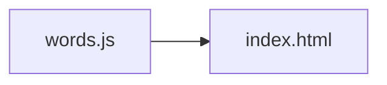

<!-- GENERATED by the doc pipeline — DO NOT EDIT. Hand edits are detected nightly and overwritten. To change this document, change the code or the harvest config (infrastructure/docs/pipeline). -->
[Scope](1_SCOPE_AND_PURPOSE.md) · **System** · [Flows](3_WORKFLOWS.md) · [Data](4_DATA_AND_INTEGRATIONS.md) · [Quality](5_QUALITY_AND_OPERATIONS.md) · [Internals](6_INTERNALS.md)

# korean-word-of-the-day — static two-view resting screen

## Components

### `words.js` — word bank

- **Role:** holds the global `window.KOREAN_WORDS` array, the single source of word data. Each entry carries `ko` (Hangul hero line), `roman` (Revised Romanization), `sound` (actual pronunciation, deliberately different from `roman`), `pos` (part of speech), `meaning` (definition), `syl` (per-syllable `[hangul, roman]` pairs), and `ex` (`[korean, english]` example sentences). Adding a word is data-only — the shape mirrors exactly what the Resting Screen renders, so no layout change is needed.
- **Entry point:** `words.js`.

### `index.html` — resting screen renderer

- **Role:** renders the two views — the word of the day and the word clock. It reads `window.KOREAN_WORDS` and rotates the displayed word deterministically by local calendar date. No API, tokens, or network are involved. The hero line auto-shrinks past 4 syllables; the design breathes best at 2–3 syllables.
- **Entry point:** `index.html`.

## Connections

- `index.html` reads `window.KOREAN_WORDS` from `words.js` to render the word of the day and the word clock.
- `words.js` provides the word bank; `index.html` consumes it — no other component reads or writes the bank.

## Diagram

