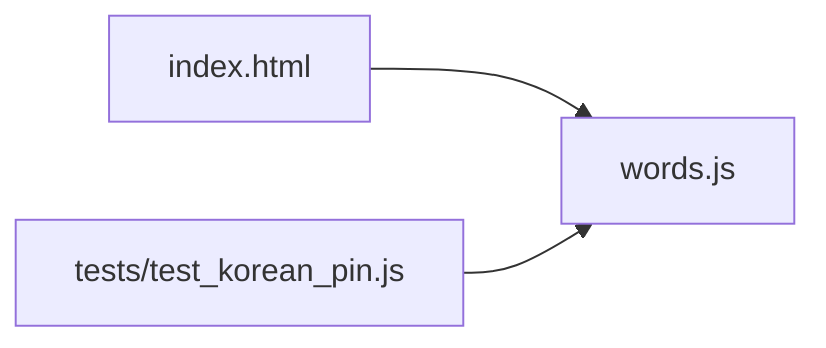

<!-- GENERATED by the doc pipeline — DO NOT EDIT. Hand edits are detected nightly and overwritten. To change this document, change the code or the harvest config (infrastructure/docs/pipeline). -->
[Scope](1_SCOPE_AND_PURPOSE.md) · **System** · [Flows](3_WORKFLOWS.md) · [Data](4_DATA_AND_INTEGRATIONS.md) · [Quality](5_QUALITY_AND_OPERATIONS.md) · [Internals](6_INTERNALS.md)

# korean-word-of-the-day — two static files, one deterministic word rotation

## Components

### `index.html`
- **Role:** the single entry point and the only page. It loads `words.js`, renders the word-of-the-day view and the word-clock view, and needs no build step, API, keys, or network. It deliberately does not fetch anything at runtime.
- **Entry point:** `index.html`.

### `words.js`
- **Role:** the word bank, a global `window.KOREAN_WORDS` array of 20 entries from 설레다 to 편안하다. Each entry carries `ko` (Hangul hero line), `roman` (Revised Romanization), `sound` (pronunciation, deliberately different from `roman`), `pos` (part of speech), `meaning`, `syl` (per-syllable `[hangul, roman]` pairs), and `ex` (`[korean, english]` example sentences). Adding a word is data-only, never a layout change.
- **Entry point:** `words.js`.

### `tests/test_korean_pin.js`
- **Role:** behavioral tests for the date-pin logic. It verifies a pinned date renders its pinned word, pins never shift the surrounding rotation, and every pin entry is shape-complete so the screen never renders blank panels.
- **Entry point:** `tests/test_korean_pin.js`.

## Connections

- `index.html` loads `words.js` and reads `window.KOREAN_WORDS` to render the daily word and the word clock.
- `words.js` exposes the word bank; it has no imports and no runtime dependencies.
- `tests/test_korean_pin.js` imports the date-pin logic from `words.js` and asserts its behavior; it does not touch `index.html`.

## Diagram

