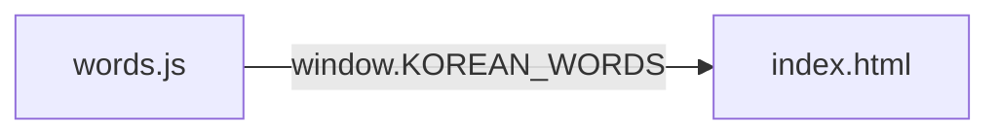

<!-- GENERATED by the doc pipeline — DO NOT EDIT. Hand edits are detected nightly and overwritten. To change this document, change the code or the harvest config (infrastructure/docs/pipeline). -->
[Scope](1_SCOPE_AND_PURPOSE.md) · **System** · [Flows](3_WORKFLOWS.md) · [Data](4_DATA_AND_INTEGRATIONS.md) · [Quality](5_QUALITY_AND_OPERATIONS.md) · [Internals](6_INTERNALS.md)

# korean-word-of-the-day — two static files, no build step, no network

## Components

### `words.js` — word bank

**Role:** holds the word-of-the-day data. Stores entries in a global `window.KOREAN_WORDS` array. Each entry carries `ko` (Hangul hero line), `roman` (Revised Romanization), `sound` (actual pronunciation, deliberately different from `roman`), `pos` (part of speech), `meaning`, `syl` (per-syllable `[hangul, roman]` pairs), and `ex` (`[korean, english]` example sentences). The shape mirrors exactly what the Resting Screen design renders, so adding a word is data-only, never a layout change. Entries should be 1–4 syllables where possible; the design breathes best at 2–3 syllables.

**Entry point:** `words.js`.

### `index.html` — resting screen renderer

**Role:** renders the two views — the word of the day and the Korean word clock. Opens directly in a browser; no build step, no API, no keys, no network calls. Rotation is deterministic by local calendar date, with no API, tokens, or network involved. Index 0 is 설레다 so day one matches the approved mockup exactly.

**Entry point:** `index.html`.

## Connections

- `index.html` reads `window.KOREAN_WORDS` from `words.js` to render the word of the day.
- `index.html` renders the word clock from the same `window.KOREAN_WORDS` data source.
- `words.js` provides the data; `index.html` renders it — `words.js` never renders, `index.html` never stores word data.

## Diagram

