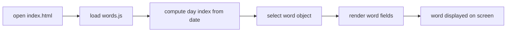
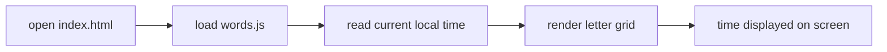
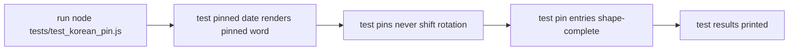

<!-- GENERATED by the doc pipeline — DO NOT EDIT. Hand edits are detected nightly and overwritten. To change this document, change the code or the harvest config (infrastructure/docs/pipeline). -->
[Scope](1_SCOPE_AND_PURPOSE.md) · [System](2_SYSTEM_ARCHITECTURE.md) · **Flows** · [Data](4_DATA_AND_INTEGRATIONS.md) · [Quality](5_QUALITY_AND_OPERATIONS.md) · [Internals](6_INTERNALS.md)

# korean-word-of-the-day — static word-of-the-day and word clock

## Workflow: Word-of-the-day render (index.html)

- **Trigger:** browser opens `index.html`; no API, tokens, or network involved.
- **Steps:**
  1. Browser loads `index.html`, which references `words.js`.
  2. `words.js` reads `window.KOREAN_WORDS`, the array of word objects (words.js:22).
  3. `words.js` computes the day's index deterministically from the local calendar date (words.js:16).
  4. `words.js` selects the word object at that index; index 0 is 설레다 so day one matches the approved mockup (words.js:17).
  5. `words.js` renders the selected word's fields: `ko` (Hangul hero glyph), `roman` (Revised Romanization), `sound` (pronunciation, deliberately not the same string as `roman`), `pos` (shown after 'Means · '), `meaning` (definition line), `syl` (per-syllable `[hangul, roman]` pairs for the Syllables block), and `ex` (`[korean, english]` pairs for the In use block) (words.js:5, 6, 7, 11, 12, 13, 14).
- **Output:** the day's word rendered on screen, with all fields populated from the selected word object.
- **Failure behavior:** UNKNOWN (fact not harvested).

## Workflow: Word clock render (index.html)

- **Trigger:** browser opens `index.html`; no API, tokens, or network involved.
- **Steps:**
  1. Browser loads `index.html`, which references `words.js`.
  2. `words.js` reads the current local time.
  3. `words.js` renders the letter grid spelling the time as a spoken Korean phrase — native Korean numerals for hours, Sino-Korean for minutes.
- **Output:** the letter grid on screen lighting the current time as a spoken Korean phrase.
- **Failure behavior:** UNKNOWN (fact not harvested).

## Workflow: Date-pin test (tests/test_korean_pin.js)

- **Trigger:** operator runs `node tests/test_korean_pin.js`.
- **Steps:**
  1. `tests/test_korean_pin.js` runs behavioral tests for the date-pin logic.
  2. The test verifies a pinned date renders its pinned word.
  3. The test verifies pins never shift the surrounding rotation.
  4. The test verifies every pin entry is shape-complete so the screen can never render blank panels.
- **Output:** test results printed to stdout; exit code 0 on success, non-zero on failure.
- **Failure behavior:** UNKNOWN (fact not harvested).

