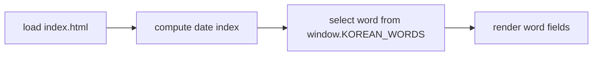
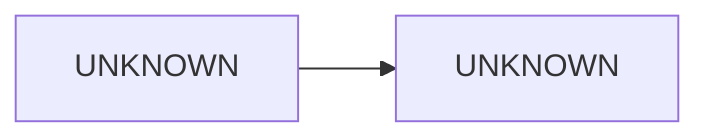

<!-- GENERATED by the doc pipeline — DO NOT EDIT. Hand edits are detected nightly and overwritten. To change this document, change the code or the harvest config (infrastructure/docs/pipeline). -->
[Scope](1_SCOPE_AND_PURPOSE.md) · [System](2_SYSTEM_ARCHITECTURE.md) · **Flows** · [Data](4_DATA_AND_INTEGRATIONS.md) · [Quality](5_QUALITY_AND_OPERATIONS.md) · [Internals](6_INTERNALS.md)

# korean-word-of-the-day — static word-of-the-day and word-clock screen

## Workflow: Word-of-the-day rotation (deterministic by date)

**Trigger:** page load of `index.html` in a browser; no API, tokens, or network involved.

**Steps:**
1. `index.html` loads `words.js`, which exposes the global `window.KOREAN_WORDS` array.
2. `words.js` computes the day's index deterministically from the local calendar date.
3. `words.js` selects the word entry at that index from `window.KOREAN_WORDS`.
4. `index.html` renders the selected entry's `ko`, `roman`, `sound`, `pos`, `meaning`, `syl`, and `ex` fields into the resting screen layout.

**Output:** the day's word rendered on screen, with Hangul hero line, romanization, pronunciation, part of speech, meaning, syllable breakdown, and example sentence.

**Failure behavior:** `UNKNOWN (fact not harvested)`.

## Workflow: Word-clock rendering

**Trigger:** UNKNOWN (fact not harvested).

**Steps:**
1. UNKNOWN (fact not harvested).

**Output:** UNKNOWN (fact not harvested).

**Failure behavior:** `UNKNOWN (fact not harvested)`.

## Workflow: Date-pin rendering

**Trigger:** UNKNOWN (fact not harvested).

**Steps:**
1. UNKNOWN (fact not harvested).

**Output:** UNKNOWN (fact not harvested).

**Failure behavior:** `UNKNOWN (fact not harvested)`.

