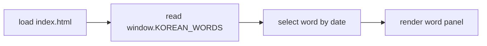
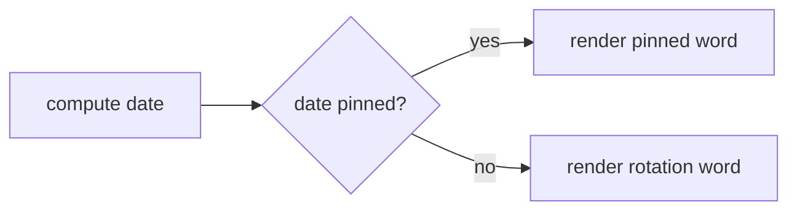

<!-- GENERATED by the doc pipeline — DO NOT EDIT. Hand edits are detected nightly and overwritten. To change this document, change the code or the harvest config (infrastructure/docs/pipeline). -->
[Scope](1_SCOPE_AND_PURPOSE.md) · [System](2_SYSTEM_ARCHITECTURE.md) · **Flows** · [Data](4_DATA_AND_INTEGRATIONS.md) · [Quality](5_QUALITY_AND_OPERATIONS.md) · [Internals](6_INTERNALS.md)

# korean-word-of-the-day — static word-of-the-day rendering

## Workflow: Word-of-the-day rendering

- **Trigger:** opening `index.html` in a browser; no schedule, API, or network call starts this flow.
- **Steps:**
  1. `index.html` loads and reads the global `window.KOREAN_WORDS` array from `words.js`.
  2. `words.js` selects the word entry deterministically by local calendar date.
  3. `words.js` renders the selected entry's Hangul, romanization, pronunciation, part of speech, meaning, syllables, and example sentences.
  4. The hero line auto-shrinks when the word has more than 4 syllables.
- **Output:** a rendered word-of-the-day panel in the browser, matching the Resting Screen design.
- **Failure behavior:** UNKNOWN (fact not harvested).

## Workflow: Date-pinned word selection

- **Trigger:** a specific calendar date matching a pinned word entry.
- **Steps:**
  1. `words.js` computes the word for the current local date.
  2. `words.js` checks whether the date has a pinned word.
  3. `words.js` renders the pinned word instead of the rotation-derived word.
- **Output:** the pinned word's panel rendered in the browser; surrounding rotation is unaffected.
- **Failure behavior:** UNKNOWN (fact not harvested).

