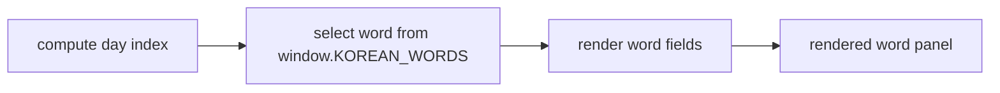

<!-- GENERATED by the doc pipeline — DO NOT EDIT. Hand edits are detected nightly and overwritten. To change this document, change the code or the harvest config (infrastructure/docs/pipeline). -->
[Scope](1_SCOPE_AND_PURPOSE.md) · [System](2_SYSTEM_ARCHITECTURE.md) · **Flows** · [Data](4_DATA_AND_INTEGRATIONS.md) · [Quality](5_QUALITY_AND_OPERATIONS.md) · [Internals](6_INTERNALS.md)

# korean-word-of-the-day — deterministic daily word rotation

## Workflow: Daily word rotation (words.js)

- **Trigger:** local calendar date change; rotation is deterministic by date, with no API, tokens, or network involved (`words.js:16`).
- **Steps:**
  1. Computes the day index from the local calendar date (`words.js`).
  2. Selects the word at that index from the global `window.KOREAN_WORDS` array (`words.js:22`).
  3. Renders the word's `ko`, `roman`, `sound`, `pos`, `meaning`, `syl`, and `ex` fields into the Resting Screen layout (`words.js:23`–`words.js:26`).
- **Output:** A rendered word-of-the-day panel in the browser. Day one renders index 0, 설레다, matching the approved mockup exactly (`words.js:17`).
- **Failure behavior:** UNKNOWN (fact not harvested).
- **Diagram:**
